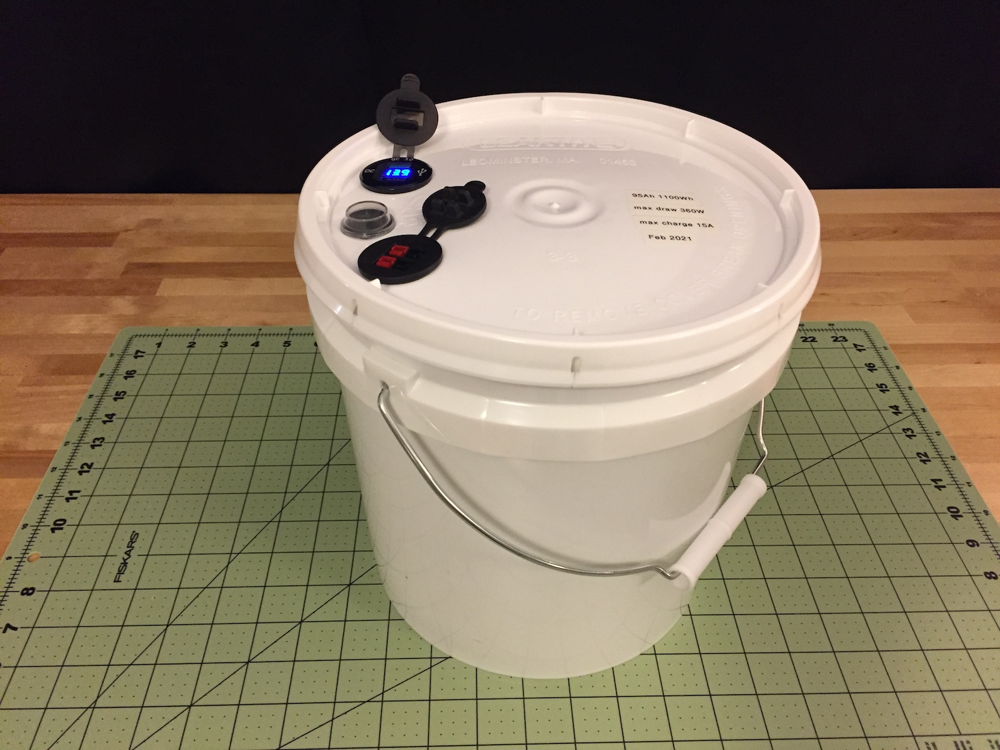

Author: Matthew Bradburn 
_Triggers: cheap Chinese stuff, risk of short circuit_ 

## Introduction

I wanted to up my battery game and was interested in the lithium chemistry, but was discouraged
by the high cost of lithium batteries from reputable manufacturers. Then I learned that cells
can be bought directly from China from manufacturers that are perhaps less reputable for _way_
cheaper. These make building batteries inexpensive and fun! This 95Ah battery and the accessories
cost a total of about $225, not including the charger. A 100Ah LiFePO4 battery from a reputable
manufacturer like Battle Born costs most of $1000, so I'm happy with how this project turned out.

The cells I bought have the Lithium Iron Phosphate (LiFePO4) chemistry. It's a good chemistry for
radio amateurs because:

- The voltage is appropriate for 12V applications. Each LiFePO4 cell has a nominal voltage of 3.2V,
so wiring up four in series gets you 12.8V, nominally. The voltage range for this battery is from around
14.2V down to around 11V, although your radio might not work when the battery is mostly
discharged. (My radio's manual says 13.8V +/- 15%, which is about 11.7V-15.9V.)

- The power density is way better than lead-acid. A 100Ah lithium battery should be
good for 100Ah of usable energy, whereas discharging a lead-acid battery to its rated capacity is
very hard on the battery. So a 100Ah lithium battery might be comparable to a 200Ah lead-acid
battery. This 100Ah lithium battery weighs less than 20 pounds, whereas a 200Ah AGM
battery weighs around 140 pounds. This is really helpful if you'd like to move your battery
from place to place without a forklift.

- The lithium battery has a flat voltage curve as it's discharged, compared to lead-acid.
It will stay at a relatively constant voltage for longer, but then the voltage falls off a cliff
as the battery approaches total discharge. That's good for keeping the radio operating longer,
the downside is that it's harder to intuit the state of charge from the voltage.

## Components

To assemble my battery, I've chosen these components:

### Cells

I ordered cells from AliExpress, which is an e-commerce platform owned by Alibaba in China. Different
vendors offer their wares there, often shipped directly from China. They have all kinds of unusual stuff
for sale at cheap prices, but the shopping experience is kind of weird &mdash; there are misspelled words
in the listings and the documentation is not the best.

[VariCore battery pack](https://www.aliexpress.com/item/1005001617660818.html)

This is a set of four 100Ah (nominal) cells, which I'll combine into a 100Ah battery. They were $160,
shipping included, so you know there must be some downside. In the data table the "delivery capacity"
is less than the nominal capacity, which may mean that they're "Grade B" cells -- maybe the
manufacturer tested them and they weren't up to snuff so they're being unloaded for cheap.

If you search around on AliExpress, there are a lot of different cells available with different
capacities, including Grade A cells.

### Battery Management System

It's a good idea to use a Battery Management System (BMS) with a lithium battery. This is a 
separate device that protects the cells by breaking the circuit before they're over-charged or
over-discharged, and it can balance the state of charge between the cells.

A good-quality BMS will also monitor the battery temperature and prevent charging when it's too
cold, since attempting to charge a LiFePO4 battery below 0&deg;C will ruin it.

Make sure you get a BMS designed for LiFePO4, since the charging voltages are different than for
lithium ion. The BMS has a wired connection to each battery cell, so it matters how many cells
you want in your battery &mdash; I'm building a "4S" battery, with four cells in series, so I need
a BMS with connections to four cells. If you were building a 24V battery you would look for an
"8S" BMS, and you would connect it to each of the 8 cells.

You may see BMS's with "common charging port" or "separate charging
port". With a common charging port there are only two main conductors from the BMS, which are used
for both charging and discharging. With separate port, there's a common lead, a lead for charging, and
another for the load. I got common port. I believe separate port is useful in solar
applications &mdash; if you have common port, there's an issue where your battery may become
fully charged, which will cause the BMS to disconnect the battery, and then you can't draw from it
until the sun goes down and the battery drops below the cut-off voltage. Separate port would allow
you to use the load even though the charging port had been disconnected. Often the allowed charging
current is lower for a separate-port BMS than for a common-port BMS.

The BMS should be sized according to the current that you want to draw from the battery. A LiFePO4
battery can often support a discharge current of 0.5C or 1C (where "C" refers to the battery capacity,
so a 100Ah battery at 0.5C would be a 50A discharge rate). Radio applications don't require high
current, so I got a 30A BMS. It provides over-current protection at 30A, so my thinking is
that I'll depend on the BMS instead of a fuse or circuit breaker, and with 30A
I can use 12ga wires, whereas if I got a 50A BMS I would need some monster cables and connectors
to allow that much current to be pulled from the battery.

You should also size your BMS to match your charger; it wouldn't do to get a BMS that supports
10 amps of charging current if you want to use a 15A charger.

Here's the one I got, also from AliExpress: [Daly LiFePO4 BMS](https://www.aliexpress.com/item/4000810904227.html)

Here's a photo. That must be the temperature sensor at the end of the small black wires.

It took just a couple of weeks to arrive from China. I paid $15 for it, shipping added about $7.

### Charger

I had a charger for lead-acid batteries, but the charging profile for lithium batteries is
different so I sprang for a new charger with a special profile for lithium:
[NOCO Charger](https://www.amazon.com/gp/product/B07W3QT226). I got a 10-amp charger so I could
charge the battery in a reasonable amount of time.

There are similar 5A and 2A chargers from NOCO that are less expensive. Amazon also has very inexpensive
lithium chargers like this one: [BikeMaster Battery Charger](https://www.amazon.com/BikeMaster-TS0207A-Lithium-Battery-Charger/dp/B0167JU8VI) ...which could be worth trying at the price.

### Enclosure

I was looking for a budget-friendly option, and a 2-gallon bucket from Home Depot fit the bill.
It's easy to imagine the battery getting rained on at a field station and the bucket is nicely
water-tight. It's barely big enough. The bucket and lid were $6.

If you get an enclosure that's not as tall, it's okay to lay the cells on their sides.  If you
do that, it's better to lay them on edge rather than stacking them like pancakes, due to the
internal architecture of the cells (I read that on the internet so it must be true).

## Construction

The plan is to assemble the battery on a temporary basis, test it, and then (assuming it
passes) assemble it more permanently. This way if I decide to try to send
the cells back I won't have spent too much time putting things together. I haven't tried
returning anything purchased from AliExpress but it's supposedly possible.

### Test Assembly

#### Collect the parts

My cells arrived from China after about seven weeks. They were well-packaged for shipping. The cells
were in good condition, all intact and so forth. They look new or near-new to me, I had wondered
if they might be used. Terminal screws and connector bars were included as expected:

I've read that sometimes grade 'B' cells have the QR codes scratched off so no one will think they're under warranty, but these have QR codes and the word "scratch" instead of a serial number. 
The QR code is just a link to the VariCore website. You can see that the terminals have had
fasteners attached, not sure if just for testing. The domed lid between the terminals is a
pressure-relief pop-off deal.

Curiously, each cell has a black plastic ring around one terminal and a red spot in the other
terminal. The one with the black ring is the _positive_ terminal and the one with the red spot is
_negative_. That was not what I expected. A voltmeter is handy for checking things like this.

The voltages of the cells must be close to the same before hooking them up to the BMS if they're
to charge properly, although the BMS can balance them to a certain extent. 
The instructions for my BMS say the cells should be within 0.05V. I measured 3.03V, 3.02V, 3.01V,
3.01V, so they're good to go. If they're too different you may need to charge the low cells
independently, which will require a charger for a single cell or a bench power supply.

#### Connect the Cells and BMS

**Safety Note**: There's a lot of energy in these cells even when they're not fully charged. Be very
careful when you're working on your cells with metal tools due to the risk of creating a short circuit.
If you drop a metal wrench across a cell's terminals,
there will be a short circuit and there could easily be enough current to weld
the wrench to the terminals, with a possibility that molten metal could fly
around at high speed and put your eye out. Wear safety glasses and maybe have a fire extinguisher
handy. Maybe put electrical tape on your tools so only one end has metal exposed. Remove
your "Mr. T"-style jewelry.

The Daly BMS has a blue wire that goes to the battery negative, and the large black wire will
become the negative to the load after the BMS is connected. Then the BMS has a set of small wires
(5 in this case) that
get connected to the cells. The small black wire goes to cell #1 negative, which is the main battery
negative. The next adjacent red wire goes to cell #1 positive. The next
wire goes to cell #2 positive, and so on. The last small wire will go to the last cell's positive
terminal, which is the main battery positive.

Here's a diagram they sent with my BMS, in case it helps. Unfortunately the instructions they
sent are for a different model, but the principal is the same even though the number of cells
is different.

It's important to get the order of these small wires right, or the balancing system won't work.
Double-check your setup.

You'll also need to use heavy-guage conductors to connect the cells together, from one cell's positive
to the next cell's negative. My cells came with metal bars to make this easy, but you can also use some
substantial wire with crimp-on connectors. The big conductors should go right next to the battery
terminals with the small ones on top, so the larger current can easily flow through the larger
conductors.

Once the big wires and the small wires are connected, plug the connector with the small wires into
the BMS, and you've got yourself a battery! Check the overall voltage to make sure it's about four
times the individual cell voltage. If everything seems okay, hook it up to your charger and charge it up.

#### Load testing

I have a battery load tester I used to check whether the battery is meeting the expected capacity
spec. It's really just a 12V heating element with a heat sink and fan, plus sensors for current and
voltage. (Also from AliExpress, find it [here](https://www.aliexpress.com/item/32866240382.html).)
As it drains the battery it calculates amp-hours and watt-hours, and can shut off when a
predetermined voltage is reached. I set it to shut off at 11.7V, which is the lower limit for
my radio's operation. My tester can only draw 150W, though, which is small compared to the battery's
rated discharge rate of ~600W but more than what I'd draw with a radio. (Hit me up if you'd like to
borrow it.)

I was able to get 95Ah out of the battery, so I'll call it good. To really test the battery I'd need
a better BMS, a bigger load, and I'd run them until the BMS cut out due to low voltage. So this is
just a rough check to make sure the cells are somewhat legit.

At this 150W load, the BMS didn't get hot at all, so I'm going to attach it directly to the cells.
If yours gets hot you may want to keep it away from the cells, either with some kind of spacer or
by attaching the BMS to the inside of the battery case somehow.

### Final Assembly

I stuck my cells to each other with squares of the 3M double-sided foam tape and then wrapped them
all with gorilla tape. These prismatic cells expand and contract a little as they're charged and discharged,
and the foam tape is meant to leave a little bit of space between cells for expansion. Some cell
manufacturers recommend that their cells be compressed to improve their lifespan, but it might not
be a big deal given how infrequently my battery will actually go through a discharge/charge cycle.

Then I attached the BMS to the cells using more double-sided foam tape. I reinstalled the conductors
between the cells and the balancing wires to the BMS, plus the large blue wire to the battery
negative and a 12-gauge THHN wire to the battery positive. I put yellow Kapton tape over the
terminals to prevent short circuits. Vinyl electrical tape should work okay too, but I'm hoping
the Kapton tape will hold up better in the long run. Then I gorilla-taped the temperature sensor to
one of the cells and taped the BMS balancing wires so they won't get snagged on things.
Use plenty of tape! I put a powerpole connector on the main positive and negative leads. I used
the high-strength foam tape to stick the battery to the bottom of my bucket and used some left-over
shipping foam around it &mdash; if the bucket gets knocked over, I don't want the wires to get yanked
around.

The user interface is in the lid. I sprang for a dual-powerpole panel-mount outlet from
PowerWerx because I liked the (somewhat?) rain-resistant cover, but it's grievously expensive
for what it is &mdash; $25, including shipping. I found more affordable ones on EBay, but without
the rain-resistant bit.

USB charging ports are nice for charging phones and things, and I have a USB reading lamp that
I could use to light the desk at a field station. This USB socket was $12 or so at Amazon, and it has a
voltmeter built in so it's easy to see whether the battery needs charging. It needs to be
switched so it won't drain the battery, so I bought a cheap weather-resistant switch off of EBay.

I did the wiring with 12ga THHN and some crimp-on terminals and wire nuts. It's not
too tricky, mostly just connecting red wires to red wires and black to black:

Here's the result &mdash; it works!

